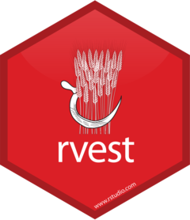

<!-- README.md is generated from README.Rmd. Please edit that file -->

```{r, echo = FALSE}
knitr::opts_chunk$set(
  collapse = TRUE, 
  comment = "#>",
  fig.path = "README-"  
)
```

# rvest 

<!-- badges: start -->
[](https://cran.r-project.org/package=rvest)
[](https://github.com/tidyverse/rvest)
[](https://codecov.io/gh/tidyverse/rvest?branch=master)
<!-- badges: end -->

## Overview

rvest helps you scrape information from web pages. It is designed to work with [magrittr](https://github.com/smbache/magrittr) to make it easy to express common web scraping tasks, inspired by libraries like [beautiful soup](https://www.crummy.com/software/BeautifulSoup/).

```{r, message = FALSE}
library(rvest)
lego_movie <- read_html("http://www.imdb.com/title/tt1490017/")

rating <- lego_movie %>% 
  html_nodes("strong span") %>%
  html_text() %>%
  as.numeric()
rating

cast <- lego_movie %>%
  html_nodes("#titleCast .primary_photo img") %>%
  html_attr("alt")
cast

poster <- lego_movie %>%
  html_nodes(".poster img") %>%
  html_attr("src")
poster
```

## Installation

Install the release version from CRAN:

```{r, eval = FALSE}
install.packages("rvest")
```

Or the development version from GitHub

```{r, eval = FALSE}
# install.packages("devtools")
devtools::install_github("tidyverse/rvest")
```

## Key functions

The most important functions in rvest are:

* Create an html document from a url, a file on disk or a string containing
  html with `read_html()`.

* Select parts of a document using CSS selectors: `html_nodes(doc, "table td")`
  (or if you've a glutton for punishment, use XPath selectors with
  `html_nodes(doc, xpath = "//table//td")`). If you haven't heard of 
  [selectorgadget](http://selectorgadget.com/), make sure to read
  `vignette("selectorgadget")` to learn about it.

* Extract components with `html_name()` (the name of the tag), `html_text()` 
  (all text inside the tag), `html_attr()` (contents of a single attribute) and 
  `html_attrs()` (all attributes).

* (You can also use rvest with XML files: parse with `xml()`, then extract 
  components using `xml_node()`, `xml_attr()`, `xml_attrs()`, `xml_text()` 
  and `xml_name()`.)

* Parse tables into data frames with `html_table()`.

* Extract, modify and submit forms with `html_form()`, `set_values()` and
  `submit_form()`.

* Detect and repair encoding problems with `guess_encoding()` and 
  `repair_encoding()`.

* Navigate around a website as if you're in a browser with `html_session()`,
  `jump_to()`, `follow_link()`, `back()`, `forward()`, `submit_form()` and
  so on. (This is still a work in progress, so I'd love your feedback.)

To see examples of these function in use, check out the demos.

## Inspirations

* Python: [RoboBrowser](http://robobrowser.readthedocs.org/en/latest/readme.html),
  [Beautiful Soup](https://www.crummy.com/software/BeautifulSoup/).
  
## Code of Conduct

Please note that the rvest project is released with a [Contributor Code of Conduct](https://rvest.tidyverse.org/CODE_OF_CONDUCT.html). By contributing to this project, you agree to abide by its terms.
